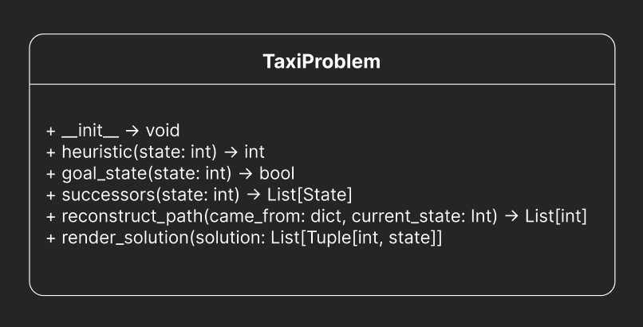

# Taxi-v3 Search Algorithms

## Table of Contents
- [Introduction](#introduction)
- [Features](#features)
- [Installation](#installation)
- [Usage](#usage)
- [Design](#design)

## Introduction
This project demonstrates the implementation of two search algorithms, **A\*** and **Iterative Deepening A***, within the `Taxi-v3` environment from OpenAI's Gym library. The objective is to solve the Taxi problem by finding an optimal path for the taxi to pick up and drop off passengers. Comments are verbose because it is part of a **university assignment**.

## Features
- **A\* Search**: An informed approach that uses a heuristic to guide the search for the optimal path.
- **Dijkstra's Algorithm**: An uninformed approach that finds the shortest path based on accumulated cost.
- **Environment Rendering**: Visualizes the solution path within the Taxi-v3 environment.
- **Comparison Mode**: Runs both algorithms in parallel and compares their solutions.

## Installation
1. Clone the repository:
    ```bash
    git clone https://github.com/mxlodyk/Taxi.git
    ```
2. Navigate to the project directory:
    ```bash
    cd Taxi
    ```
3. Install the required dependencies:
    ```bash
    pip install -r requirements.txt
    ```

### Command Line
```bash
python main.py
```

### Prerequisites
- Python 3.10.x
- OpenAI Gymnasium library

## Usage
To run the program, execute the `main.py` script. You can do this either from the command line or by running the script in your preferred Integrated Development Environment (IDE).

## Design


## Screenshots


## Videos
https://www.youtube.com/watch?v=U_n79-Ajna0
